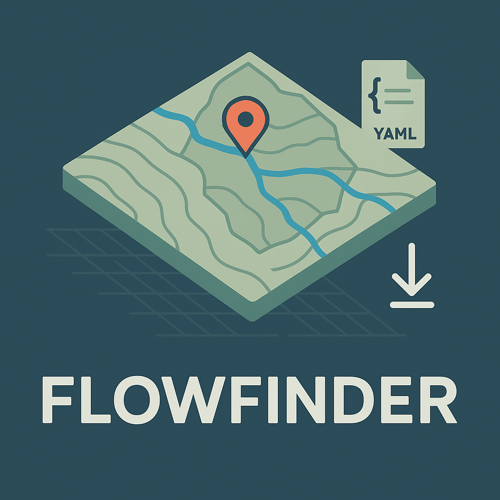

# FLOWFINDER Accuracy Benchmark System

A rigorous accuracy benchmark for the FLOWFINDER watershed delineation tool, focusing on basins within the Mountain West region of the U.S. This system validates FLOWFINDER's core claims: fast (<30s) delineation and high spatial accuracy (targeting 95% Intersection over Union, or IOU) using 10 m DEM data.



## 🎯 Objectives

- Quantify delineation accuracy across terrain and basin complexity
- Test whether the 30s runtime and 95% IOU targets are realistically achievable
- Identify terrain/flowline conditions under which FLOWFINDER underperforms
- Provide a reproducible benchmarking framework and publish transparent results

## 📋 Prerequisites

- Python 3.8+
- FLOWFINDER CLI tool installed and accessible
- Access to USGS NHD+ HR data and 3DEP 10m DEM data
- 8GB+ RAM recommended for processing large datasets

## 🚀 Quick Start

### 1. Installation

```bash
# Clone the repository
git clone <repository-url>
cd flowfinder-benchmark

# Install dependencies
pip install -r requirements.txt

# Copy environment template
cp .env.example .env
# Edit .env with your data paths and FLOWFINDER configuration
```

### 2. Data Preparation

Place your input datasets in the `data/` directory:

```
data/
├── huc12_mountain_west.shp    # HUC12 boundaries for Mountain West
├── nhd_hr_catchments.shp      # NHD+ HR catchment polygons
├── nhd_flowlines.shp          # NHD+ HR flowlines
└── dem_10m.tif               # 10m DEM mosaic or tiles
```

### 3. Run the Benchmark

```bash
# Step 1: Generate stratified basin sample
python scripts/basin_sampler.py --config config/basin_sampler_config.yaml

# Step 2: Extract truth polygons
python scripts/truth_extractor.py --config config/truth_extractor_config.yaml

# Step 3: Run FLOWFINDER benchmark
python scripts/benchmark_runner.py \
    --sample basin_sample.csv \
    --truth truth_polygons.gpkg \
    --config config/benchmark_config.yaml \
    --outdir results/
```

## 📁 Project Structure

```
├── README.md                    # Project overview + setup
├── requirements.txt             # Python dependencies
├── pyproject.toml              # Modern Python project config
├── .env.example                # Environment template
├── .gitignore                  # Standard Python gitignore
│
├── config/                     # Configuration files
│   ├── basin_sampler_config.yaml
│   ├── truth_extractor_config.yaml
│   └── benchmark_config.yaml
│
├── scripts/                    # Core benchmark scripts
│   ├── basin_sampler.py       # Stratified basin sampling
│   ├── truth_extractor.py     # Truth polygon extraction
│   └── benchmark_runner.py    # FLOWFINDER accuracy testing
│
├── data/                       # Input datasets (gitignored)
├── results/                    # Output directory (gitignored)
├── tests/                      # Unit tests
├── docs/                       # Documentation
│   ├── PRD.md                  # Product Requirements Document
│   ├── test_coverage/          # Test coverage documentation
│   └── development/            # Development notes
│
└── notebooks/                  # Jupyter exploration
    └── benchmark_analysis.ipynb
```

## 🔧 Configuration

The system uses YAML configuration files for each component:

- **`config/basin_sampler_config.yaml`**: Basin sampling parameters, data paths, stratification settings
- **`config/truth_extractor_config.yaml`**: Truth polygon extraction settings, quality thresholds
- **`config/benchmark_config.yaml`**: FLOWFINDER CLI settings, accuracy thresholds, timeout values

See individual config files for detailed parameter descriptions.

## 📊 Outputs

### Basin Sampling (`basin_sampler.py`)
- `basin_sample.csv`: Stratified sample of 50+ basins with metadata
- `basin_sample.gpkg`: Spatial version of sample (optional)
- `basin_sample_summary.txt`: Sampling statistics and quality report

### Truth Extraction (`truth_extractor.py`)
- `truth_polygons.gpkg`: Ground truth watershed polygons
- `truth_polygons_summary.txt`: Extraction quality report
- `truth_polygons_errors.csv`: Failed extractions log

### Benchmark Results (`benchmark_runner.py`)
- `benchmark_results.json`: Detailed per-basin metrics
- `accuracy_summary.csv`: Tabular results for analysis
- `benchmark_summary.txt`: Performance analysis and key findings
- `errors.log.csv`: Processing failures and diagnostics

## 🎯 Success Metrics

| Metric                    | Target                           |
| ------------------------- | -------------------------------- |
| IOU (mean)                | ≥ 0.90                           |
| IOU (90th percentile)     | ≥ 0.95                           |
| Runtime (mean)            | ≤ 30 s                           |
| Benchmark reproducibility | 100% (via GitHub repo + scripts) |
| Error-free basin coverage | ≥ 90% of selected sample         |

## 🧪 Testing

```bash
# Run unit tests
python -m pytest tests/

# Run with coverage
python -m pytest tests/ --cov=scripts --cov-report=html
```

## 📈 Analysis

Use the Jupyter notebook for detailed analysis:

```bash
# Start Jupyter
jupyter lab notebooks/

# Open benchmark_analysis.ipynb for interactive exploration
```

## 🤝 Contributing

1. Fork the repository
2. Create a feature branch (`git checkout -b feature/amazing-feature`)
3. Commit your changes (`git commit -m 'Add amazing feature'`)
4. Push to the branch (`git push origin feature/amazing-feature`)
5. Open a Pull Request

## 📄 License

This project is licensed under the MIT License - see the [LICENSE](LICENSE) file for details.

## 🙏 Acknowledgments

- USGS for NHD+ HR and 3DEP data
- FLOWFINDER development team
- Open source geospatial community

## 📞 Support

For issues and questions:
- Check the [documentation](docs/)
- Review the [PRD](docs/PRD.md)
- Open an issue on GitHub

---

*"Measure twice, delineate once. Truth earns trust."* 